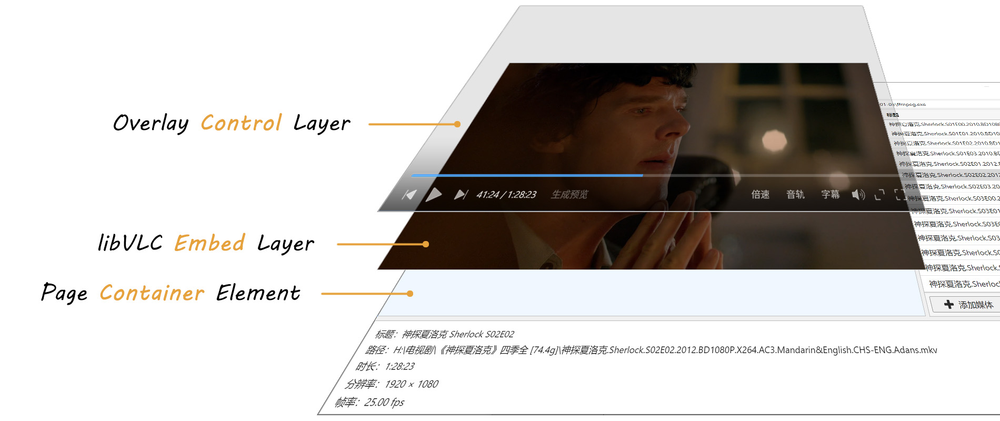

# Electron VLC Player

[English](README.md) | 中文

以一种更简单的方式，在 Electron 页面中嵌入 libVLC 播放器，用于支持更多的视频格式。


> [!NOTE]
> 不支持页面滚动，只支持固定位置。

## 安装

```bash
npm install electron-vlc-player
```

`postinstall` 会按你项目中的 **Electron 版本**自动编译 native 模块（`vlc_binding.node`）。请预先安装对应平台的 **C++ 构建工具**（见下文「Native 模块编译」）。

## 用法

```ts
import { BrowserWindow } from "electron";
import { VlcPlayer } from "electron-vlc-player";

const win = new BrowserWindow({ width: 1280, height: 720 });
await win.loadFile("index.html");

const player = new VlcPlayer({
  window: win,
  container: "#player",
  vlcDir: "/path/to/libvlc",
});

await player.embed();
player.setSource("/path/to/video.mkv");
player.on("playing", () => console.log("playing"));
player.setRate(1.25);
```

## 要求

### 操作系统

| 平台        | 最低版本（建议）                                                                | 说明                                                                                  |
| ----------- | ------------------------------------------------------------------------------- | ------------------------------------------------------------------------------------- |
| **Windows** | **Windows 10** 及以上                                                           |                                                                                       |
| **macOS**   | **macOS 11 Big Sur** 及以上                                                     |                                                                                       |
| **Linux**   | **Ubuntu 20.04** / **Debian 11** / **Fedora 34** 或同等新发行版（glibc ≥ 2.31） | 嵌入依赖 **X11**（`libX11`）；纯 Wayland 会话未专门测试，通常需经 **XWayland** 使用。 |

### Electron / Node.js

| 项目         | 要求            |
| ------------ | --------------- |
| **Electron** | **`>= 28.0.0`** |
| **Node.js**  | **`>= 18.0.0`** |

### Native 模块编译

本包 **仅面向 Electron**，npm 包内 **不包含** 预编译的 `vlc_binding.node`。

**自动编译：** `npm install` 时会按你项目中 Electron 的**目标架构**（与 `process.arch` 一致）尝试本地编译 `vlc_binding.node`。

**手动重编**（`postinstall` 失败、升级 Electron 后等）：

```bash
# 在应用项目根目录
npx electron-rebuild -f -w electron-vlc-player

# 在本仓库根目录开发库本身时
npm run rebuild
```

环境变量 `SKIP_EVP_NATIVE_REBUILD=1` 可跳过 `install` 脚本中的自动重编。

请同时满足：

- 已安装对应平台的 **C++ 构建工具**（见下表）
- **libVLC 与 Electron 为同一架构**（例如 Apple Silicon 上需 arm64 版 VLC / libVLC）

| 平台        | 构建依赖                                                       |
| ----------- | -------------------------------------------------------------- |
| **Windows** | Visual Studio Build Tools（「使用 C++ 的桌面开发」）、Python 3 |
| **macOS**   | Xcode Command Line Tools                                       |
| **Linux**   | `build-essential`、`libx11-dev`、Python 3                      |

实际可运行的平台与架构组合，以 **Electron 官方支持**及你能否为该架构提供匹配的 libVLC 为准。

### libVLC 运行时与 `vlcDir`

> [!IMPORTANT]
> 本模块**不包含** libVLC 运行时，须通过 **`vlcDir`** 传入 libVLC 根目录（**库不会自动配置**）。

> [!NOTE]
> 目前**仅支持 VLC 3.0.x**（VLC 4.x 嵌入播放尚不稳定）。

可选用 **`probeDefaultVlcDir()`** 探测各平台常见 VLC 安装路径，探测到后再传给 `VlcPlayer`：

```ts
import { VlcPlayer, probeDefaultVlcDir } from "electron-vlc-player";

const vlcDir = probeDefaultVlcDir();
if (!vlcDir) throw new Error("请安装 VLC 或手动指定 vlcDir");

new VlcPlayer({ window: win, container: "#player", vlcDir });
```

- 选项1：用户安装 VLC，用 `probeDefaultVlcDir()` 或手动路径作为 `vlcDir`
- 选项2：应用打包 libVLC，将其**在应用中的相对路径**传给 `vlcDir`（用户无需另装 VLC，但会增加应用体积）

`vlcDir` 目录需包含对应平台的 libVLC 主库与 `plugins` 目录。

#### Windows

```text
<vlcDir>/
  libvlc.dll
  libvlccore.dll
  plugins/
```

#### macOS

通常为 VLC.app 内的 `MacOS` 目录，例如：

```text
/Applications/VLC.app/Contents/MacOS/
  libvlc.dylib
  libvlccore.dylib
  plugins/
```

#### Linux

常见为系统包路径（`libvlc.so` 所在目录）并确保 `plugins` 可访问：

```text
/usr/lib/x86_64-linux-gnu/   # 或 /usr/lib64
  libvlc.so
```

插件多在 `/usr/lib/vlc/plugins/`。若 `vlcDir` 下没有 `plugins` 子目录，请把 `vlcDir` 设为同时包含 `libvlc.so` 与 `plugins/` 的目录（例如自解压的 VLC 运行时根目录），或自行打包成与 Windows 相同的 `vlcDir/plugins` 布局。

#### 示例

```ts
import { VlcPlayer } from "electron-vlc-player";

// Windows
new VlcPlayer({
  window: win,
  container: "#player",
  vlcDir: "C:\\Program Files\\VideoLAN\\VLC",
});

// macOS
new VlcPlayer({
  window: win,
  container: "#player",
  vlcDir: "/Applications/VLC.app/Contents/MacOS",
});

// Linux
new VlcPlayer({
  window: win,
  container: "#player",
  vlcDir: "/usr/lib/x86_64-linux-gnu",
});
```

> [!NOTE]
> 动态 **更换** `vlcDir` 或 **硬件加速**（`hardwareAcceleration`）时，须先 `destroy()`，再用新配置重新创建 `VlcPlayer`。

## 集成注意

> [!WARNING]
> 在 **Windows** 上，**请勿在应用入口调用 `app.disableHardwareAcceleration()`**，会与本库的 **透明 overlay 控制层** 冲突：Chromium 会改走软件合成路径，全透明区域容易被系统当成可穿透，鼠标事件落到下层 **libVLC 子窗口**，表现为「只有底栏能点、画面区感应不到」。

> [!WARNING]
> 控制栏为 **主窗口子 BrowserWindow**，打开系统文件对话框时，若仍显示 overlay 子窗并与之交互，Electron/Win32 会 **激活该子窗** 导致控制栏盖在文件对话框上面。
>
> 所以打开文件框前需先 **`player.hideOverlay()`**，结束后 **`player.showOverlay()`**：

```ts
player.hideOverlay();
try {
  const result = await dialog.showOpenDialog(mainWindow, {
    properties: ["openFile"],
  });
  // ...
} finally {
  player.showOverlay();
  player.focusOverlay();
}
```

## API

### `VlcPlayer`

`VlcPlayer` 继承 `LibVLC`（libVLC 播放 API + 事件），**`embed()` 之后可直接** `player.play()`、`player.setSource()`、`player.on('playing')` 等。

**嵌入与布局：**

- `embed()` / `isEmbedded()` / `destroy()`
- `setContainer()` / `setPageFullscreen()` / `setFullScreen()`（及 `isPageFullscreen()` / `isFullScreen()`）
- `hideOverlay()` / `showOverlay()` / `focusOverlay()`（系统文件对话框、播放列表切歌后恢复 overlay 焦点，见上文「集成注意」）

**libVLC 播放控制**（`embed()` 后可用）：

| 类别 | 方法                                                                                                                                                                                   |
| ---- | -------------------------------------------------------------------------------------------------------------------------------------------------------------------------------------- |
| 媒体 | `setSource`, `getMediaInfo`, `parseMedia`, `getMediaMetadata` / `getMediaMetadataResult`, `getMediaTracks` / `getMediaTracksResult`, `unloadMedia` |
| 播放 | `play`, `pause`, `stop`, `togglePause`, `setPaused`, `isPlaying`, `getState`, `getRate`, `setRate`, `setPlaylist`, `playPrevious`, `playNext`, `hasPrevious`, `hasNext`, `getPlaybackMode`, `setPlaybackMode` |
| 进度 | `getTime`, `setTime`, `getLength`, `getPosition`, `setPosition`, `isSeekable`                                                                                                          |
| 音量 | `getVolume`, `setVolume`, `toggleMute`, `getMute`, `setMute`, `getAudioDelay`, `setAudioDelay`                                                                                         |
| 轨道 | `getAudioTracks`, `getAudioTrack`, `setAudioTrack`, `getSubtitleTracks`, `getSubtitleTrack`, `setSubtitleTrack`, `addSubtitleFile`, `getVideoTracks`, `getVideoTrack`, `setVideoTrack` |
| 视频 | `getScale`, `setScale`, `getAspectRatio`, `setAspectRatio`, `setCropGeometry`, `getVideoSize`, `takeSnapshot`                                                                          |
| 章节 | `getChapter`, `setChapter`, `nextChapter`, `previousChapter`, `getTitleDescriptions` 等                                                                                                |
| 其它 | `navigate`, `setVlcFullscreen`, `setRole`, `getFps`, `hasVout`                                                                                                                         |

常量：`VlcState`, `VlcNavigate`, `VlcRole`, `VlcEvent`, `VlcEventName`。

### 事件订阅

```ts
const onPlaying = () => console.log("开始播放");
player.on("playing", onPlaying);
player.off("playing", onPlaying);

player.on("endReached", (ev) => console.log("结束", ev.time));
```

常用事件：`playing` | `paused` | `stopped` | `endReached` | `timeChanged` | `positionChanged` | `lengthChanged` | `buffering` | `error` | `playlistItemChanged`（见 `VlcEventName`）。

### 控制条「页面全屏」按钮

- 构造选项 `pageFullscreenButton`（默认 `true`）：设为 `false` 时不显示「页面全屏」按钮。

#### 硬件加速

libVLC 支持通过参数 **`--avcodec-hw=`** 控制解码硬件加速。

| 取值                | 说明                       |
| ------------------- | -------------------------- |
| `none`              | 禁用硬件解码（**默认**）   |
| `any`               | 由 libVLC 自动选择可用后端 |
| `d3d11va` / `dxva2` | Windows 常见后端           |
| `vaapi` / `drm`     | Linux 常见后端             |
| `videotoolbox`      | macOS                      |

```ts
import {
  VlcPlayer,
  getHardwareAcceleration,
  setHardwareAcceleration,
} from "electron-vlc-player";

const player = new VlcPlayer({
  window: win,
  container: "#player",
  vlcDir: "C:\\Program Files\\VideoLAN\\VLC",
  hardwareAcceleration: "d3d11va",
});

console.log(getHardwareAcceleration()); // "d3d11va"

// 切换模式须重新创建实例
await player.destroy();
setHardwareAcceleration("any");
const player2 = new VlcPlayer({ window: win, container: "#player", vlcDir });
```

### 多语言（控制条 UI）

内置控制条、轨菜单、字幕对话框等 UI 文案支持多语言。

- 构造选项 **`locale`**（可选，BCP 47，如 `zh-CN`、`en`、`ja`）：省略时按 Electron / 系统语言自动选择；无匹配内置语言包时回退英语。
- **`SUPPORTED_PLAYER_LOCALES`**：查看支持的语言列表。
- 运行时 **`getLocale()`** / **`setLocale(locale)`**：切换控制条语言（会同步更新 overlay）。

```ts
import { VlcPlayer, SUPPORTED_PLAYER_LOCALES } from "electron-vlc-player";

console.log(SUPPORTED_PLAYER_LOCALES); // ['en', 'zh-CN', 'zh-TW', 'ja', ...]

const player = new VlcPlayer({
  window: win,
  container: "#player",
  vlcDir,
  locale: "zh-CN",
});

player.setLocale("ja");
```

### 进度条悬停预览

控制条支持为**本地文件**离线生成悬停预览雪碧图（类似视频网站）。**网络 URL / 流媒体**不支持生成与悬停预览图。

> [!NOTE]
> VLC 3.x 没有提供后台截图的接口，需要跳转到指定时间进行截图，我尝试过创建一个**不可见的第二播放器**来截图，但效果并不理想，所以引入了 ffmpeg 来生成预览雪碧图。
>
> 生成预览雪碧图的耗时受视频分辨率影响，目前使用下来，1080P 及以下的生成速度尚可接受，2K/4K 的耗时就有些太长了。

**前置条件：**

1. 媒体源为本地路径或 `file://`（见 `isLocalMediaSource()`）
2. 构造 `VlcPlayer` 时传入 **`ffmpegPath`**（ffmpeg 可执行文件），或之后调用 `setFfmpegPath`（**库不会自动探测**）

可选用 `probeDefaultFfmpegPath()` 辅助探测后再传入：

```ts
new VlcPlayer({
  window: win,
  container: "#player",
  vlcDir: probeDefaultVlcDir() ?? "/path/to/libvlc",
  ffmpegPath: probeDefaultFfmpegPath() ?? undefined, // 或直接 "C:\\ffmpeg\\bin\\ffmpeg.exe"
  seekPreviewCacheDir: "D:/cache/evp-preview", // 可选，默认 %TEMP%/evp-preview
});
```

未配置有效 ffmpeg 时，控制栏**不显示**「生成预览」按钮。

**流程：**

1. 打开本地视频后，点击控制栏「生成预览」（生成中显示百分比且不可重复点击）
2. ffmpeg **单次**顺序解码（优先 `-hwaccel auto` 硬解，失败则回退软解），经 `fps → scale → tile` 输出 `sprite.jpg`
3. 生成完成后，悬停进度条即可**即时**显示预览

**缓存目录**（默认 `%TEMP%/evp-preview`，全局共用）：

```text
{seekPreviewCacheDir}/{mediaKey}/index.json
{seekPreviewCacheDir}/{mediaKey}/sprite.jpg
```

| API                                                                                     | 说明                             |
| --------------------------------------------------------------------------------------- | -------------------------------- |
| `ffmpegPath`（构造选项） / `setFfmpegPath` / `getFfmpegPath`                            | ffmpeg 可执行文件路径（全局）    |
| `seekPreviewCacheDir`（构造选项） / `setSeekPreviewCacheDir` / `getSeekPreviewCacheDir` | 预览雪碧图缓存根目录（全局）     |
| `clearSeekPreviewCacheDir()`                                                            | 取消进行中的生成并清空缓存根目录 |
| `generateSeekPreviewSprite()`                                                           | 为当前本地媒体生成雪碧图         |
| `cancelSeekPreviewSprite()`                                                             | 取消生成（仅删 `.work/` 半成品） |

换片、`destroy()` **不会**自动删除已完成的雪碧图，需自行调用 `clearSeekPreviewCacheDir()` 或手动删目录。磁盘上已有雪碧图但未配置 ffmpeg 时：**按钮隐藏**，**悬停仍可用缓存**。

长片采用自适应间隔（约 300 帧上限）：`intervalMs = max(2000, ceil(durationMs/300/1000)*1000)`。

```ts
import {
  VlcPlayer,
  probeDefaultVlcDir,
  probeDefaultFfmpegPath,
} from "electron-vlc-player";

const player = new VlcPlayer({
  window: win,
  container: "#player",
  vlcDir: probeDefaultVlcDir() ?? "/path/to/libvlc",
  ffmpegPath: probeDefaultFfmpegPath() ?? undefined,
  seekPreviewCacheDir: "D:/cache/evp-preview", // 可选
});

player.on("seekPreviewError", (err) => console.error(err));
player.generateSeekPreviewSprite(); // 或由控制栏「生成预览」触发
```

### 播放列表与控制条「播放上一个媒体 / 播放下一个媒体」

内置控制条可在播放键两侧显示「播放上一个媒体」「播放下一个媒体」按钮。

- 通过构造选项 `playlist: string[]` 或 `setPlaylist(paths)` 传入**路径/URL 列表**（与你在页面里自维护的 UI 列表互不冲突，可只把同一份路径数组同步给播放器以启用按钮）。
- **至少 2 条**时控制条才显示这两个按钮；未配置或只有 1 条时隐藏。
- `playPrevious()` / `playNext()` 在列表内切换媒体；`hasPrevious()` / `hasNext()` 表示是否可切换。
- 默认 `autoAdvancePlaylist: true`：当前条目 `endReached` 且存在下一项时自动播放下一个媒体（`playNext()`）。
- **`playbackMode`**（默认 `default`）：片尾行为——`loop` 列表循环、`repeat` 单曲循环；可用 `getPlaybackMode()` / `setPlaybackMode()` 动态切换。
- 通过控制条或 API 切换媒体后会触发 `playlistItemChanged`（`{ src, index }`），便于更新标题、侧栏列表等；**播放器已 `setSource`，监听方无需再调一次 `setSource`**。

```ts
player.setPlaylist(["/a.mkv", "/b.mkv", "/c.mkv"]);
player.setPlaybackMode("loop"); // 或 "repeat" | "default"
player.on("playlistItemChanged", ({ src, index }) => {
  console.log("now playing", index, src);
});
```

轨道切换（控制条「音轨」「字幕」弹层或 `set*Track` 均会触发）：

```ts
player.on("audioTrackChanged", ({ trackId }) => {
  /* 当前音轨 id */
});
player.on("videoTrackChanged", ({ trackId }) => {
  /* 当前视频轨 id */
});
player.on("subtitleTrackChanged", ({ trackId }) => {
  /* trackId === -1 表示关闭字幕 */
});
```

自定义 overlay 右键菜单（坐标相对 overlay 客户区）：

```ts
import { Menu } from "electron";

player.on("overlayContextMenu", () => {
  Menu.buildFromTemplate([
    { label: "复制路径", click: () => console.log(player.getSource()) },
  ]).popup({ window: win });
});
```

`parseMedia()` 可获取媒体元数据/轨信息/时长。

> libVLC 3 通过 `libvlc_media_tracks_get`（或旧版 `libvlc_media_get_tracks_info`）读取轨表；播放中调用可能不稳定，库会在必要时退回可切换轨列表。

```ts
player.setSource("/path/to/video.mp4");
player
  .parseMedia()
  .then(({ metadata, tracks, tracksNotice, length, info }) => {
    console.log(metadata.title, tracks, length);
  })
  .catch((err) => console.error(err));
```

`tracks` 列出文件内各条流（含每条视频轨的 `width`/`height` 等）；**当前正在播放哪一条**用 `getVideoTrack()` / `getAudioTrack()` / `getSubtitleTrack()`（见下）。

**当前选中轨道**（返回 libVLC 轨道 id，与 `get*Tracks()` 列表中的 `id` 对应；字幕关闭时为 `-1`）。

```ts
const videoId = player.getVideoTrack();
const audioId = player.getAudioTrack();
const subId = player.getSubtitleTrack(); // -1 表示未显示字幕

const video = player.getVideoTracks().find((t) => t.id === videoId);
const audio = player.getAudioTracks().find((t) => t.id === audioId);
```

播放中可用 `getVideoSize()`、`getFps()` 读取**当前解码画面**的分辨率/帧率。

解析完成后，可用 `getMediaMetadataResult()` 读取媒体元数据，播放中可用 `getMediaTracksResult()` 读取文件内各条流。

> [!WARNING]
> **Paused 状态勿读 media 轨表**（易崩溃），完整轨表请在播放中或停止后获取。

```ts
const { data: meta, notice } = player.getMediaMetadataResult();
const { data: tracks, notice: tracksNotice } = player.getMediaTracksResult();
// 未 parse 时 `notice` 会提示先调用 parseMedia()；非空 notice 仅表示结果可能不完整
```

#### `probeMedia()` — 不加载进播放器

`parseMedia()` 针对**当前已 `setSource` 的媒体**；若只需在播放列表等场景预读时长/基础元数据，可用包级 **`probeMedia()`**：

- **不**切换当前片源、**不**开始播放
- 须已 init libVLC（例如 `VlcPlayer` 已 `embed()`）
- 返回 `MediaProbeResult`：`parsed`、`length`（毫秒，0 为未知）、`metadata`（`title` / `artist` / `album` / `genre`）
- **不含**轨列表、分辨率、帧率等；完整信息仍用 `parseMedia()` 或播放后 `getVideoSize()` / `getFps()`

```ts
import { probeMedia } from "electron-vlc-player";

// 后台逐条 probe 播放列表条目（勿阻塞 UI 过久时可自行排队）
const { parsed, length, metadata } = probeMedia("/path/to/video.mkv", 15_000);
if (parsed && length > 0) {
  console.log(metadata.title, length);
}
```

底层绑定：`getBinding()` 返回完整 `VlcBinding`。`getLibVlcVersion()` 查询 libVLC 版本。

`mediaOptions` 示例：

```ts
player.setSource("https://example.com/live.m3u8", {
  mediaOptions: [":network-caching=3000"],
});
```

自定义右键菜单：监听 `overlayContextMenu`（`{ x, y }` 为 overlay 客户区坐标）后可自行 `Menu.popup`

### 工具

- `probeMedia(src, timeoutMs?)` — 解析路径/URL 的时长与基础元数据，不加载进播放器（须已 init libVLC）；返回 `MediaProbeResult`
- `probeDefaultVlcDir()` — 可选探测常见 VLC / libVLC 安装路径（返回 `string | null`）
- `resolveVlcDir(vlcDir)` — 校验并规范化 libVLC 目录
- `getHardwareAcceleration()` / `setHardwareAcceleration(mode)` — 查询或切换进程级 `--avcodec-hw`
- `normalizeHardwareAcceleration(mode)` — 校验并规范化硬件加速取值
- `probeDefaultFfmpegPath()` — 可选探测常见 ffmpeg 路径及 `PATH`（返回 `string | null`）
- `resolveFfmpegExecutable(path)` — 校验 ffmpeg 可执行文件

### 内置快捷键

overlay 获得焦点时，支持鼠标与键盘操作。

**鼠标**

| 操作     | 说明        |
| -------- | ----------- |
| 鼠标滚轮 | 音量 ±1%    |
| 单击     | 播放 / 暂停 |
| 双击     | 切换全屏    |

**键盘**

| 按键                | 说明                |
| ------------------- | ------------------- |
| `空格`              | 播放 / 暂停         |
| `T`                 | 切换网页全屏        |
| `F`                 | 切换全屏            |
| `Esc`               | 退出全屏 / 网页全屏 |
| `←` / `→`           | 后退 / 前进 10 秒   |
| `Shift` + `←` / `→` | 后退 / 前进 3 秒    |
| `Ctrl` + `←` / `→`  | 后退 / 前进 1 分钟  |
| `Alt` + `←` / `→`   | 后退 / 前进 1 帧    |
| `↑` / `↓`           | 音量 +10% / -10%    |

## 源码结构

```text
src/
  index.ts                 # 对外导出
  types.ts                 # 公共 TypeScript 类型（含 MediaQueryResult 等）
  native.ts                # N-API binding 加载与 initLibVlc / probeMedia
  vlc-path.ts              # vlcDir 探测与校验
  vlc-constants.ts         # libVLC 状态 / 事件 / 轨类型常量
  vlc-event-names.ts       # 事件名映射
  hardware-acceleration.ts
  seek-preview-sprite.ts   # 进度条预览雪碧图（ffmpeg）
  overlay-path.ts          # 编译后解析 overlay 资源路径
  i18n/                    # 控制条多语言包
  libvlc/
    LibVLC.ts              # libVLC 媒体播放器 API（parse / 轨 / 播放控制）
    index.ts
  vlc-player/              # Electron 嵌入层（组合多个 controller）
    VlcPlayer.ts           # 主入口，继承 LibVLC
    layout.ts              # 窗口 / 容器布局与 native 嵌入
    playlist.ts            # 播放列表与 loop / repeat
    overlay/               # 透明 overlay 窗口
    seek.ts, ipc.ts, …
overlay/                   # 内置播放控件（HTML/CSS/JS，注入 overlay）
example/src/               # Electron 示例（主进程按模块拆分）
```

`VlcPlayer` 继承 `LibVLC`：嵌入与 UI 在 `vlc-player/`，底层播放与媒体解析在 `libvlc/`。

## 工作原理

播放器在 Electron 窗口内叠加三层结构：



| 层级 | 作用 |
| ---- | ---- |
| **页面目标元素（Page container element）** | 渲染进程页面中的 DOM 元素（构造选项 `container`，如 `#stage`）。库会测量该元素的边界，并将视频窗口与 overlay 对齐到该区域。 |
| **libVLC 嵌入层（libVLC embed layer）** | 由 N-API 绑定创建的原生子窗口。libVLC 在此表面解码并输出画面。 |
| **Overlay 控制层（Overlay control layer）** | 与容器对齐的透明子 `BrowserWindow`，加载内置 HTML/CSS/JS 控制条。用户操作与状态更新经 IPC 与主进程通信。 |

页面加载完成后调用 `embed()` 即可创建并对齐上述三层。容器尺寸变化、页面全屏与窗口全屏由库自动处理。

## License

MIT
