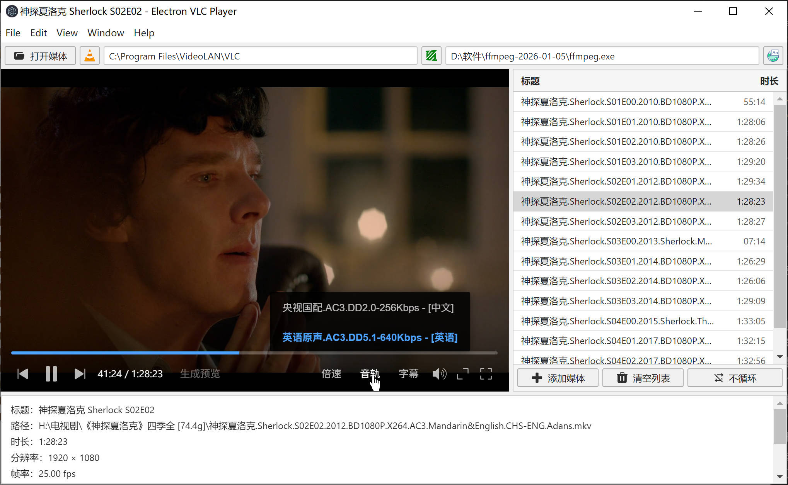

# Electron VLC Player — Example

English | [中文](README_zh.md)

Desktop player example built on [electron-vlc-player](https://www.npmjs.com/package/electron-vlc-player).



## Prerequisites

See the repo root [README § Requirements](../README.md#requirements) ([中文](../README_zh.md#要求)) for full platform / Electron / libVLC details.

Summary:

1. [VLC](https://www.videolan.org/vlc/) **3.0.x** installed (libVLC + `plugins`; VLC 4.x is not supported)
2. **Electron >= 28** (this example uses 33.x), **Node.js >= 18** (20/22 recommended)
3. **Windows 10+** / **macOS 11+** / **Linux (X11)**
4. On Windows, native rebuild requires [Visual Studio Build Tools](https://visualstudio.microsoft.com/visual-cpp-build-tools/) with “Desktop development with C++”

## Run the app

```bash
npm install
npm start
```

## Develop against the local library

```bash
npm install
npm run link         # use local electron-vlc-player@file:..
npm run rebuild      # rebuild native binding for current Electron
npm start
```

After changing library code:

```bash
npm run rebuild
npm start
```

| Command               | Purpose                                                                 |
| --------------------- | ----------------------------------------------------------------------- |
| **`npm run link`**    | Switch dependency to local `electron-vlc-player@file:..`              |
| **`npm run rebuild`** | Rebuild the library (`tsc` + `vlc_binding.node` for current Electron) |
| **`npm start`**       | Build example `src/` only, verify artifacts, launch Electron          |
| **`npm run unlink`**  | Restore npm registry version of `electron-vlc-player`                 |

`npm install` postinstall runs the same steps as `rebuild` (slow on first install).

## Layout

Three rows: top bar → center (player + playlist) → bottom bar.

Page `preload` exposes `window.evpLayout.notify()` so the player’s `ResizeObserver` on `#stage` can sync layout with the main process.

- **Top bar**: open media, VLC path, FFmpeg path
- **Center**: `#stage` (libVLC video + overlay controls) + playlist sidebar (footer: add / clear / loop mode)
- **Bottom bar**: current media metadata

## Minimal playback test (crash debugging)

Must run with **Electron** (do not use `node scripts/smoke-play.cjs` — `app` will be undefined).

Uses `test/smoke.html` as the embed page (`data:` URLs yield zero-size containers — audio only, no video). Default file: `test/nice.mp4`:

```bash
npm run smoke-play
```

Custom file:

```bash
npm run smoke-play -- "C:\path\to\video.mkv"
```

## VLC path

On startup the example calls **`probeDefaultVlcDir()`**. If nothing is found, pick the VLC directory from the top bar (still validated via `resolveVlcDir`).

## Seek-bar hover preview (ffmpeg)

The control bar **Generate preview** button requires a **local video file** and **`ffmpegPath`** when constructing `VlcPlayer` (or later via `setFfmpegPath`). The library does not auto-detect ffmpeg.

The example passes `probeDefaultFfmpegPath()` into the constructor when found. You can also hard-code a path:

```ts
new VlcPlayer({
  window: mainWindow,
  container: "#stage",
  vlcDir: resolved,
  ffmpegPath: "C:\\ffmpeg\\bin\\ffmpeg.exe",
});
```

If not configured, the terminal may show:

```text
[example] ffmpeg not found; call VlcPlayer.setFfmpegPath(...) in main.ts ...
[electron-vlc-player] ffmpeg path not configured; seek preview unavailable
```

After configuration, open a **local file** and the **Generate preview** button appears next to the time display.

## Common logs and errors

- **`crashpad_client_win.cc(868) not connected`**: crash report noise; if the app misbehaves, run `npm run rebuild` then `npm start`.
- **`Cannot find module '...\vlc_binding.node'`** or missing **`dist/`**: run `npm run rebuild`.
- Cannot click the video area: do not call `app.disableHardwareAcceleration()` at app entry (see root README “Integration notes”).
